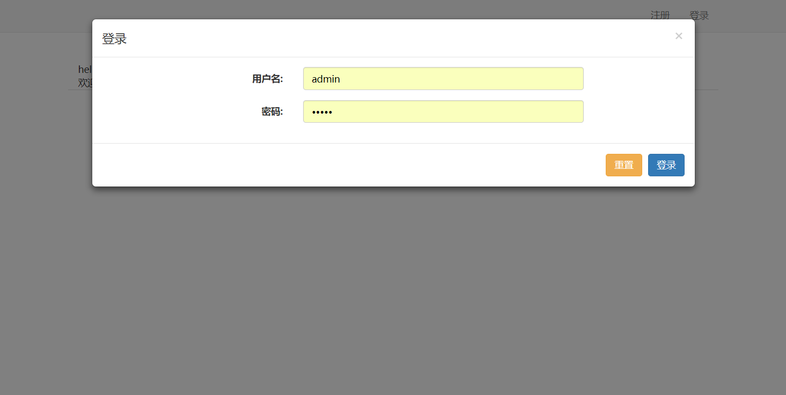
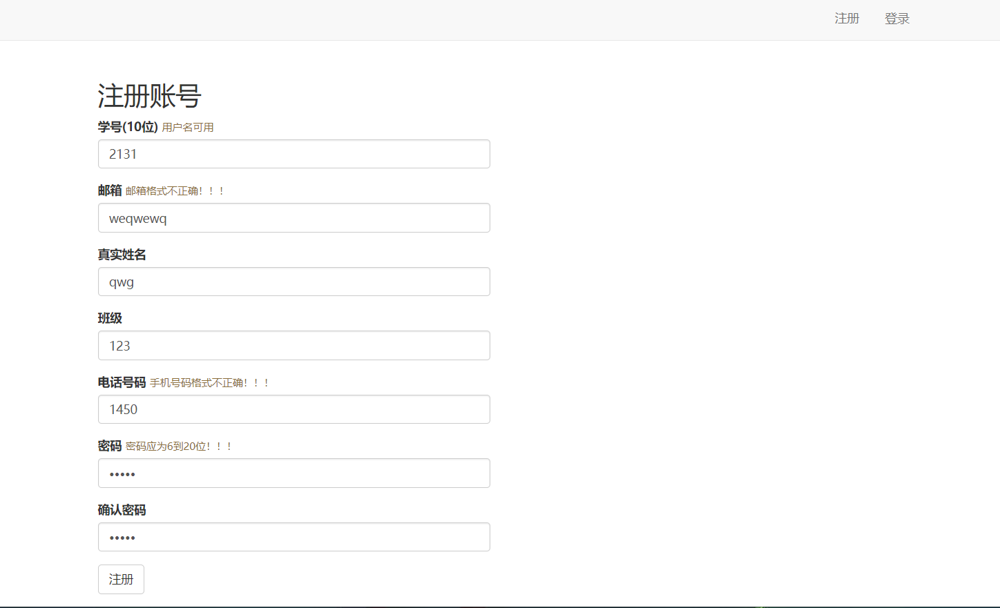

# 网站登陆注册Demo（SSM框架）
Spring + SpringMVC + MyBatis 框架做一个简单的登陆注册网站Demo。  
相当于搭了一个JavaWeb的架子，初学ssm框架的开发者可以拿来连连手，也可以在基础上做一些其它扩充工作。  
此登陆注册模块也有简单的合法性验证

## 相关环境
- 后端开发：Java
- 开发工具：eclipse
- 使用框架：Maven + Spring + SpringMVC + MyBatis
- 数据库：mysql

## 代码目录
- `/pom.xml` maven配置文件

- `/src/main/java/` 后台工作目录
	
	`com.matrix.controller` 服务层代码
	
	`com.matrix.controller` 控制器层代码

    `com.matrix.dao` 数据库访问层代码
	
	`com.matrix.entity` 模型层
	
	`com.matrix.common` 一些通用工具封装

- `/src/main/resources/` 配置目录

	`applicationContext.xml` spring配置文件
	
	`springmvc-servlet.xml` springMVC配置文件
	
	`mybatis/` 数据库映射Mapper文件目录
	
- `/src/main/webapp/` 前端目录

## 效果图

## 功能逻辑
1.注册->存储数据->hello页面  
2.登录->用户管理页面->查询和删除  
3.退出->hello页面  

## Developer
qiwenkaikai@qq.com

